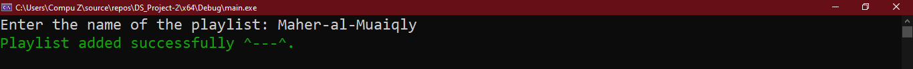
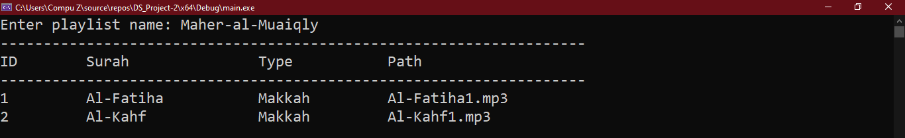

# Quran-Playlist-Manager

A comprehensive console-based application for managing playlist.

This project was developed as part of the 2024 Data Structures course at Zagazig University. It leverages a custom-built Doubly linked list data structure, showcasing a range of object-oriented programming (OOP) principles. This project provided hands-on experience with data structure design, algorithm efficiency, and OOP concepts, allowing for both learning and practical application of these key software engineering skills.

## Project UML

## Project Details

 ### 1# Main Page
 At the start of the program, the project has no data.You have the option to add data or import it from a file.

 ### 2# Adding new playlist
 We can add a new playlist by selecting option 1
 

 ### 3# Adding new surah
 We can add a new surah by selecting option 2 and if the playlist name is don't exist you will try again
 

 ### 4# Removing existing surah 
 We can remove a surah by selecting option 4 and if the surah name  is don't exist you will try again

 ### 5# Change the order of existing playlist 
 we can change the order of playlist by selection option 4 and if the playlist name  is don't exist you will try again
 

 ### 6# Display all playlists 
 we can display all current plalists by selecion option 5

 ### 7# Display all playlists and them surahs
 we can display all playlists and them surahs by selection option 6

 
 ### 8# Display surahs in a specific playlist
 we can display surahs in a specific playlist by seletion option 7

 

